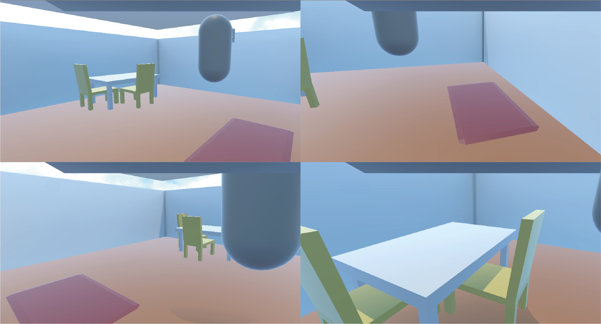

# Supplementary Material for my Master's Thesis

## Overview

This repository contains Unity packages, which include the applications I developed for my master's thesis, titled:

**Creating Presence for Social Cross-Reality Situations**

The audio files used in the master's thesis are also in the repository in the audio-files directory.

## Unity

I have used Unity version 2022.3.22, but it should work in version 2022.3.51 too.

### Installation

It is important to **clone** the repository and not to download it as a ZIP because of the LFS system. Git LFS must be installed to ensure that large files are downloaded correctly.

Each `.unitypackage` file can be imported into a Unity project to add the contents.

The apps are as packages in the git repo, as this is the easiest and fastest way to run the apps. The complete Unity projects take up too much space.

The easiest way to run the VR applications is to create a new project with the "VR "template in Unity and import the packages there. The template already contains all the required dependencies such as the XR Interaction Toolkit.

The same applies to the smartphone apps. There should be used the template "2D Mobile".

The smartphone applications run on iOS, the VR apps on Meta Quest 2. There seems to be a problem with the DNS and the Photon frameworks on the Quest that needs to be fixed. It could be due to an update. However on a computer the apps work fine with the XR Device Simulator.

### Usage

To run the applications, the scene "**TestScene**" must be selected in the Unity projects. The VR and the mobile applications can be run in Unity.
In each case, one VR application and one mobile application belong together (e.g. [direct-audio-smartphone-app](direct-audio-smartphone-app) <-> [direct-audio-vr-app](direct-audio-vr-app)).

The smartphone application must be started first because of the player reference (mobile user has to be player 1) for the remote procedure calls (only important for the indirect audio app).

#### Experiment

To conduct the experiment as in my master's thesis, the smartphone app must be deployed on a smartphone. I used an iPhone 8 Plus. The [Tracking System](https://github.com/nils-nilsen/human-apriltag-tracking) must be used to track the person in the real room. The position is sent to the smartphone via UDP. The local IP address of the smartphone must be set in the tracking system code to send the data to the correct application. If you want to test the smartphone application with the tracking yystem in Unity, you can use your local IP address `127.0.0.1.`.

Each pair of applications is one condition in the experiment:
 - **Direct Audio:** [Direct Audio - Smartphone-App](direct-audio-smartphone-app) <-> [Direct Audio - VR-App](direct-audio-vr-app)
 - **Indirect Audio:** [Indirect Audio - Smartphone App](indirect-audio-smartphone-app) <-> [Indirect Audio - VR-App](indirect-audio-vr-app)

## Technical Documentation

Documentation of the key technical features.

### VR Applications

The main functionalities in the VR-App for indirect audio happen in the `SoundInteraction` GameObject.

The GameObject contains several scripts:
#### VRSoundInteraction:

The `VRSoundInteraction` script handles player sound interactions in the application environment. The main functionalities include:

- **Area-Based Sound Interaction:** The player’s proximity to two areas (in this cas a carpet and a table) is tracked. When the player enters or exits these areas, different sounds are triggered using RPC calls through the PlaySoundRPC component. The exit sound is in this case the sound of walking on a wooden floor.
- **Multiplayer Setup:** The script waits for the multiplayer environment to be initialized and only activates when the `PlaySoundRPC` component is available. Once multiplayer is ready, an exit sound is played automatically.
- **Player Movement Detection:** The player's position is constantly monitored, and sound interactions are updated when the player moves beyond a defined threshold distance.
- **Dynamic Area Indicators:** Planes are dynamically placed in the environment to represent the defined interaction areas, with different colors indicating different areas (e.g., red for the carpet, green for the table). _For debugging purpose._

#### VoiceChatManager

The `VoiceChatManager` script is responsible for managing voice chat functionality in the vr application using Photon Voice and Fusion Networking. Key features include:
- **Voice Chat Toggle:** Allows users to enable or disable the voice chat either manually via a button or programmatically. The Photon Voice recorder handles the microphone transmission. Used for testing purposes.
- **UI Status Update:** The current voice chat status (enabled/disabled) is displayed on the screen using a TextMeshPro text element. _For debugging purpose._
- **Audio Feedback:** Plays an audio clip when the voice chat is enabled, providing feedback to the user.
- Network Integration: Implements basic network callbacks using INetworkRunnerCallbacks to handle player actions such as joining or leaving the application.

#### PlayerProximityChecker

The `PlayerProximityChecker` script automatically manages the activation of voice chat based on the proximity of players in a multiplayer environment. It works in conjunction with the VoiceChatManager to toggle voice chat when players are within a certain distance of each other. Key functionalities include:

- **Proximity-Based Voice Chat:** The script calculates the distance between two players and activates voice chat if they are within a specified proximity. If they move too far apart, the voice chat is automatically disabled.
- **Multiplayer Initialization:** The script continuously checks if two players are present in the scene and only starts managing proximity once both players have joined. If a player leaves, the voice chat is deactivated, and the script resets to await two players again.
- **Button Toggle Control:** When the players are close enough to each other, the script disables the manual voice chat toggle button, ensuring that the proximity rule takes precedence. Once they are far apart again, the button is re-enabled (Button is used for testing purposes).

#### PlaySoundRPC

The `PlaySoundRPC` script is responsible for managing and playing the sounds in a multiplayer environment using Fusion Networking. This script allows sounds to be triggered remotely through RPC (Remote Procedure Call) commands, ensuring that audio events are synchronized across the network. Key functionalities include:

- `PlayEnterAreaSoundRpc()`: Used to play the carpet sound.
- `PlayExitAreaSoundRpc()`: Used to play the floor sound.
- `PlayTableSoundRpc()`: Used to play the table sound.
- `StopSoundRpc()`: Stops sound.

### Smartphone Applications

The smartphone apps differ in how they receive/generate the sounds.
As in the VR application, the main functionalities run in the `SoundInteraction` GameObject.

#### Indirect Audio Smartphone Application

The scripts for the RPC from the VR app are the same. A key feature of the mobile app is the player positioning through the tracking system, received via UDP. This happens in the `UDP Receiver` GameObject, which contains the `UDPReceiver` Script. The `PlayerMovement` script uses the data from the UDP Receiver for player positioning. The player's position is transmitted to the other player using Photon Fusion.

#### Direct Audio Smartphone Application

The `PlayerProximityChecker` script manages proximity-based voice chat and radar feedback between players in a multiplayer environment. The `Update()` function automatically enables voice chat when players are within the defined `proximityDistance` and disables it when they move apart, while also controlling the state of the voice chat button. The radar feedback system, managed by the `StartRadar()` function, plays a radar ping using `PlayRadarPing()` at intervals that decrease as the players get closer. The `GetDistanceBetweenPlayers()` function calculates the 2D distance between players to control both the voice chat and radar systems.

## Video

A video of the prototype can be found on [Youtube](https://youtu.be/LO0nUNsAlCQ).

## Real-Time Tracking System

The code for the real-time tracking system can be found
[here](https://github.com/nils-nilsen/human-apriltag-tracking).

## License
This project is licensed under the MIT License, which allows for free use, modification, and distribution of the project, as long as the following conditions are met:

- Respect the Rights of Third-Party Frameworks and Libraries: While this project itself is distributed under the MIT License, it may include or depend on third-party frameworks, libraries, or packages that are subject to different licenses. It is your responsibility to comply with the respective licensing terms of any external components used in this project.